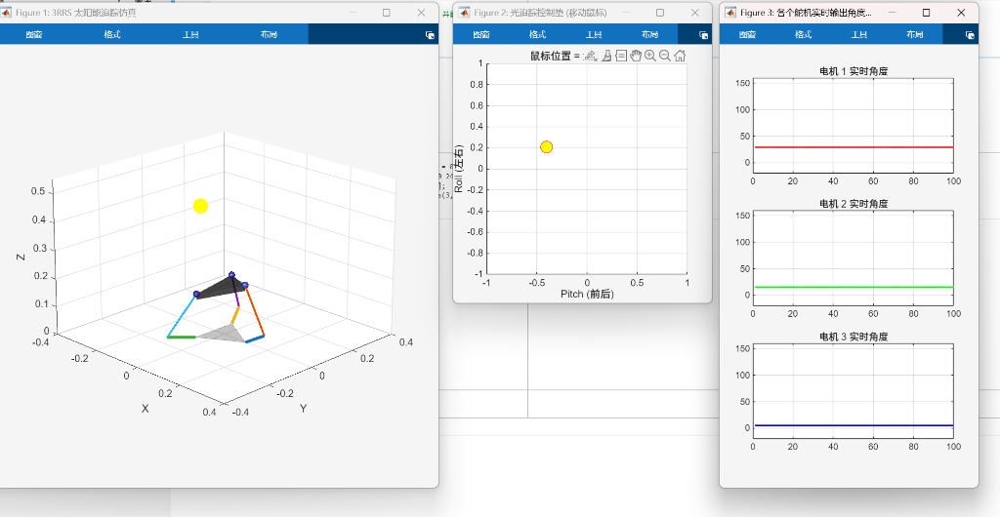
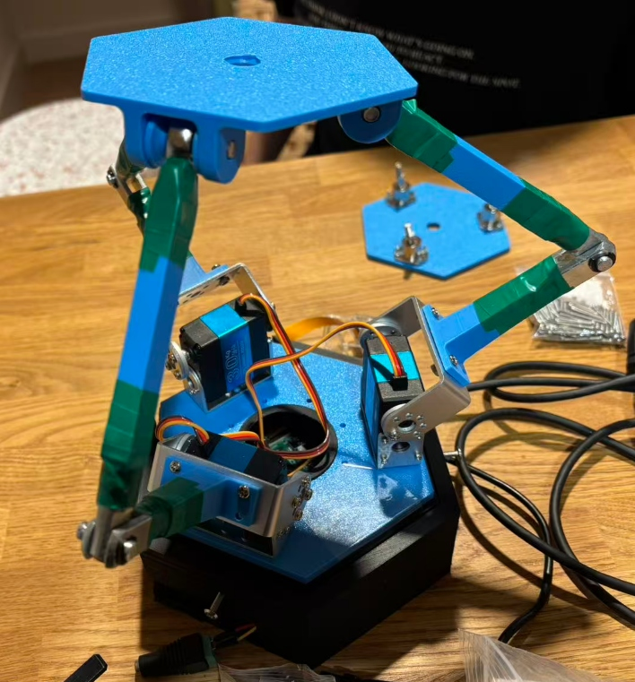

# 3RRS 并联平台太阳追踪系统



基于 3-RRS 并联机构的太阳追踪控制系统。MATLAB 负责运动学仿真与控制指令生成，经串口传至 STM32F103，驱动 PCA9685 舵机驱动板控制三路舵机。

> **后续完整项目**：本仓库为早期验证版本（STM32 + MATLAB）。完整的基于 **Raspberry Pi 5** 的实现版本（视觉检测与运动控制全部在树莓派上运行）请访问：
> 👉 [Real-Time-Stewart-Solar-Tracker / Solar-Stewart-Tracker](https://github.com/Real-Time-Stewart-Solar-Tracker/Solar-Stewart-Tracker)

---

## 系统架构

```
MATLAB (PC)
  ├── sun.m       ← 纯仿真，验证 IK 与 PID 算法
  └── sun211.m    ← 仿真 + 硬件控制（串口输出）
        │  串口 115200 baud
        │  协议: "S1:090\n"
        ▼
STM32F103 (Core/Src/main.c + usart.c)
        │  I2C
        ▼
PCA9685 舵机驱动板 (Core/Src/pca9685.c)
        │  50Hz PWM (500~2500 µs)
        ▼
三路舵机（对应 3-RRS 三条支链）
```

---

## 文件结构

```
tracker_MATLAB_STM32/
├── sun.m               # MATLAB 纯仿真程序（无硬件依赖）
├── sun211.m            # MATLAB 仿真 + 串口控制程序
├── testmotor.ioc       # STM32CubeMX 配置文件
├── Core/
│   ├── Inc/
│   │   ├── pca9685.h   # PCA9685 驱动接口声明
│   │   ├── usart.h
│   │   └── i2c.h
│   └── Src/
│       ├── main.c      # STM32 主程序，OnServoCommand() 实现
│       ├── pca9685.c   # PCA9685 I2C 驱动（50Hz PWM 输出）
│       ├── usart.c     # 串口中断接收，指令解析
│       └── i2c.c
├── MDK-ARM/
│   └── testmotor.uvprojx   # Keil MDK 工程文件
├── images/
│   ├── matlab_sim.png  # MATLAB 仿真界面截图
│   └── hardware.jpg    # 实物照片
└── Drivers/            # STM32 HAL 库
```

---

## 机构参数

| 参数 | 值 | 说明 |
|------|----|------|
| `Rb` | 0.20 m | 静平台连接点半径 |
| `Rp` | 0.12 m | 动平台连接点半径 |
| `h`  | 0.18 m | 初始平台高度 |
| `L1` | 0.10 m | 主动臂长度 |
| `L2` | 0.18 m | 从动臂长度 |
| 最大追踪角度 | ±35° | Roll / Pitch 方向 |

---

## MATLAB 程序说明

### `sun.m` — 纯仿真
- 不依赖硬件，串口连接失败时自动跳过
- 适合在没有硬件时验证 IK 算法和 PID 参数

### `sun211.m` — 仿真 + 硬件控制
- 自动枚举可用串口，或手动指定 `portPref`
- 鼠标在"控制垫"窗口移动即可控制追踪目标方向
- 以 50Hz 频率向 STM32 发送舵机指令，仅角度变化时发送

**三个可视化窗口：**

| 窗口 | 内容 |
|------|------|
| 窗口 1 | 3RRS 机构 3D 动画 + 空中太阳小球 |
| 窗口 2 | 鼠标控制垫（Roll/Pitch 目标输入） |
| 窗口 3 | 三路舵机实时输出角度曲线 |

**串口协议：**
```
S1:090   ← 舵机1，90°
S2:045   ← 舵机2，45°
S3:120   ← 舵机3，120°
```

---

## STM32 固件说明

### 硬件配置
| 外设 | 引脚/配置 |
|------|-----------|
| USART1 | 115200 baud，8N1 |
| I2C1 | 连接 PCA9685（地址 0x40）|
| PCA9685 PWM | 50Hz，通道 0/1/2 对应舵机 1/2/3 |

### PCA9685 驱动（`pca9685.c`）
- `PCA9685_Init50Hz()` — 初始化为 50Hz PWM
- `PCA9685_ServoWriteDeg(addr, ch, deg)` — 角度转脉宽输出
- 脉宽范围：500 µs（0°） ~ 2500 µs（180°）

---

## 快速开始

### 1. 运行纯仿真（无需硬件）
```matlab
run('sun.m')
```

### 2. 连接硬件运行
1. 烧录 STM32 固件（Keil 工程：`MDK-ARM/testmotor.uvprojx`）
2. 修改 `sun211.m` 中的串口配置：
   ```matlab
   portPref = "COM5";  % 填入实际 COM 口，留空则自动选择
   ```
3. 在 MATLAB 中运行：
   ```matlab
   run('sun211.m')
   ```

### 3. 舵机调零
```matlab
servoOffset = [90 90 90];   % 各舵机中位角度
servoDir    = [-1 -1 -1];   % 方向：1 或 -1
```

---

## 依赖环境

| 端 | 要求 |
|----|------|
| MATLAB | R2019b 及以上（需支持 `serialport` 函数） |
| Keil MDK | V5，含 STM32F1xx HAL 库 |
| 硬件 | STM32F103 开发板 + PCA9685 模块 + 三路舵机 |

---

## 后续项目

本仓库为项目的早期验证阶段，使用 PC 端 MATLAB 完成运动学解算并通过 STM32 控制舵机。

后续我们将系统完整迁移至 **Raspberry Pi 5**，实现：
- 基于 OpenCV 的红色光源实时视觉追踪（CSI 摄像头）
- 运动学解算与 PID 控制全部在树莓派上运行
- 通过 PCA9685 直接驱动舵机，无需 STM32 中间层

👉 **完整版仓库**：[Real-Time-Stewart-Solar-Tracker / Solar-Stewart-Tracker](https://github.com/Real-Time-Stewart-Solar-Tracker/Solar-Stewart-Tracker)

---

## 实物照片


