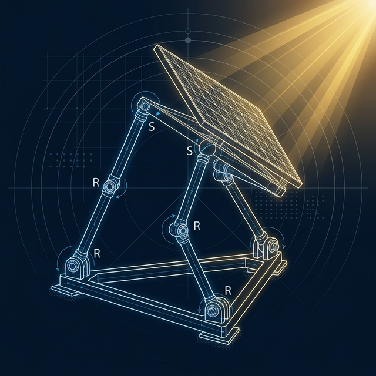
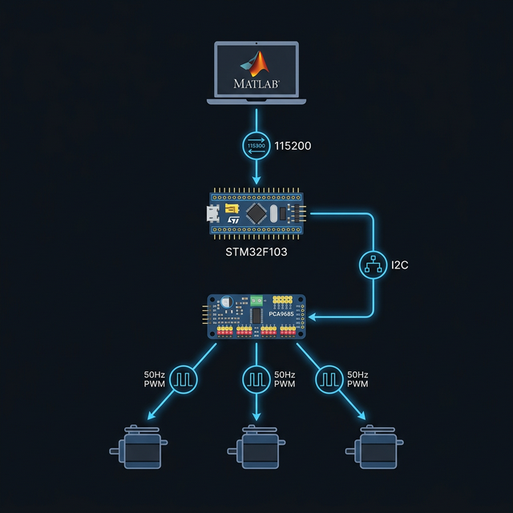
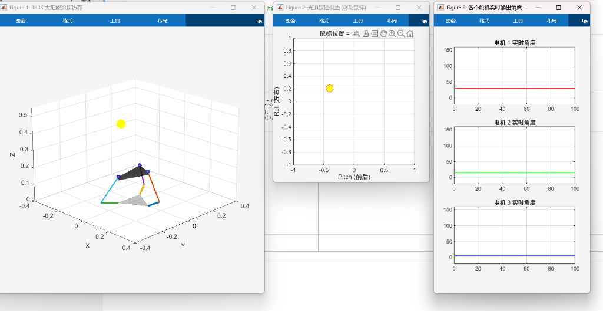
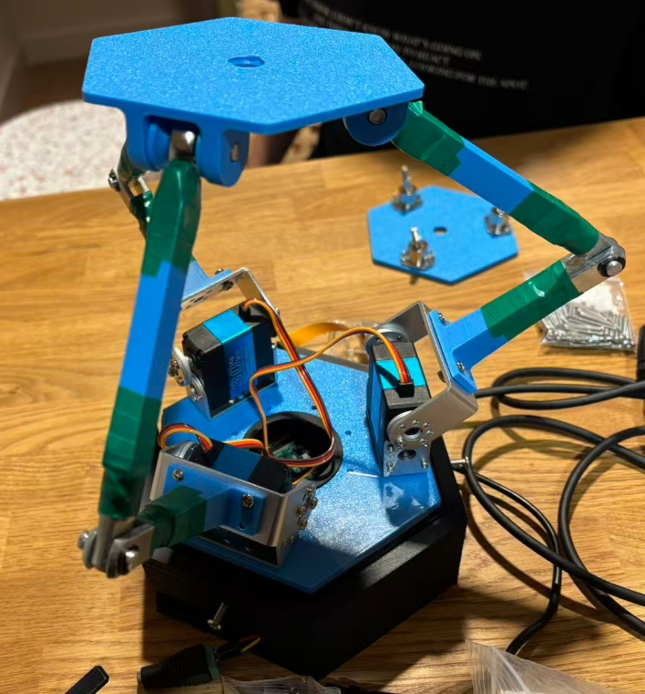

<div align="center">


# ☀️ 3-RRS 并联平台太阳追踪系统

**基于 3-RRS 并联机构的双轴太阳追踪控制系统**

[](https://opensource.org/licenses/MIT)
[](https://www.mathworks.com/products/matlab.html)
[](https://www.st.com/)
[]()
[](https://github.com/jichaowang02-lang/3RRS-tracker_test)

[English](README_EN.md) · [快速开始](#-快速开始) · [系统架构](#-系统架构) · [完整版仓库 →](https://github.com/Real-Time-Stewart-Solar-Tracker/Solar-Stewart-Tracker)

---

*MATLAB 运动学仿真与控制指令生成 → STM32F103 串口通信 → PCA9685 舵机驱动 → 三路舵机联动*

</div>

## 📋 目录

- [项目简介](#-项目简介)
- [功能特性](#-功能特性)
- [系统架构](#-系统架构)
- [机构参数](#-机构参数)
- [文件结构](#-文件结构)
- [快速开始](#-快速开始)
- [MATLAB 程序说明](#-matlab-程序说明)
- [STM32 固件说明](#-stm32-固件说明)
- [串口通信协议](#-串口通信协议)
- [实物与测试](#-实物与测试)
- [依赖环境](#-依赖环境)
- [后续项目](#-后续项目)
- [许可证](#-许可证)

---

## 🌟 项目简介

<div align="center">

</div>

<br>

本项目实现了一个基于 **3-RRS（Revolute-Revolute-Spherical）并联机构** 的太阳追踪控制系统。系统通过 MATLAB 在 PC 端完成**逆运动学（IK）解算**和 **PID 闭环控制**，经串口将舵机指令传至 STM32F103 微控制器，再通过 I²C 总线驱动 PCA9685 舵机驱动板，最终控制三路舵机实现平台的**双轴跟踪运动**。

> [!NOTE]
> 本仓库为项目的**早期验证版本**（STM32 + MATLAB）。完整的基于 Raspberry Pi 5 的实现版本请访问 👉 [Solar-Stewart-Tracker](https://github.com/Real-Time-Stewart-Solar-Tracker/Solar-Stewart-Tracker)

---

## ✨ 功能特性

| 特性 | 描述 |
|:---:|:---|
| 🔢 **逆运动学仿真** | MATLAB 实现 3-RRS 并联机构逆运动学解算 |
| 🎯 **PID 闭环控制** | 平滑的舵机角度过渡，避免抖动 |
| 🖱️ **交互式控制** | 鼠标控制垫实时调整追踪目标方向 |
| 📡 **串口通信** | 115200 baud 串口协议，仅角度变化时发送 |
| 🔧 **模块化设计** | MATLAB 仿真与硬件控制分离，可独立运行 |
| 📊 **实时可视化** | 三个可视化窗口同步显示追踪状态 |

---

## 🏗️ 系统架构

<div align="center">

</div>

<br>

```
┌─────────────────────────────────────────────────────┐
│                    MATLAB (PC)                       │
│  ┌──────────┐    ┌───────────────────────────────┐  │
│  │  sun.m   │    │         sun211.m              │  │
│  │ 纯仿真    │    │  仿真 + 硬件控制（串口输出）    │  │
│  │ IK + PID │    │  IK + PID + Serial TX         │  │
│  └──────────┘    └──────────────┬────────────────┘  │
└─────────────────────────────────┼────────────────────┘
                                  │ UART 115200 baud
                                  │ 协议: "S1:090\n"
                                  ▼
┌─────────────────────────────────────────────────────┐
│              STM32F103 微控制器                       │
│  ┌───────────┐    ┌────────────────────────────┐    │
│  │  usart.c  │───▶│       main.c               │    │
│  │ 串口中断   │    │  OnServoCommand() 指令解析  │    │
│  └───────────┘    └─────────────┬──────────────┘    │
└─────────────────────────────────┼────────────────────┘
                                  │ I²C
                                  ▼
┌─────────────────────────────────────────────────────┐
│            PCA9685 舵机驱动板                         │
│  ┌─────────────────────────────────────────────┐    │
│  │  pca9685.c                                  │    │
│  │  50Hz PWM 输出 · 脉宽 500~2500 µs           │    │
│  └──────────┬──────────┬──────────┬────────────┘    │
└─────────────┼──────────┼──────────┼──────────────────┘
              │ CH0      │ CH1      │ CH2
              ▼          ▼          ▼
         ┌────────┐ ┌────────┐ ┌────────┐
         │ 舵机 1  │ │ 舵机 2  │ │ 舵机 3  │
         │ 支链 A  │ │ 支链 B  │ │ 支链 C  │
         └────────┘ └────────┘ └────────┘
```

---

## 📐 机构参数

<div align="center">

| 参数 | 符号 | 值 | 说明 |
|:---:|:---:|:---:|:---|
| 基座半径 | `Rb` | 0.20 m | 静平台连接点半径 |
| 动平台半径 | `Rp` | 0.12 m | 动平台连接点半径 |
| 基座高度 | `h` | 0.18 m | 初始平台高度 |
| 连杆 1 长度 | `L1` | 0.10 m | 主动臂长度 |
| 连杆 2 长度 | `L2` | 0.18 m | 从动臂长度 |
| 最大追踪角度 | — | ±35° | Roll / Pitch 方向 |

</div>

> [!TIP]
> 机构参数在 MATLAB 文件顶部定义，可根据实际机构尺寸进行调整。

---

## 📁 文件结构

```
3RRS-tracker_test/
│
├── 📄 sun.m                    # MATLAB 纯仿真程序（无硬件依赖）
├── 📄 sun211.m                 # MATLAB 仿真 + 串口控制程序
├── 📄 testmotor.ioc            # STM32CubeMX 配置文件
├── 📄 README.md                # 项目说明（中文）
├── 📄 README_EN.md             # 项目说明（English）
├── 📄 LICENSE                  # MIT 许可证
│
├── 📂 Core/
│   ├── 📂 Inc/
│   │   ├── pca9685.h           # PCA9685 驱动接口声明
│   │   ├── usart.h             # 串口头文件
│   │   └── i2c.h               # I²C 头文件
│   └── 📂 Src/
│       ├── main.c              # STM32 主程序，OnServoCommand()
│       ├── pca9685.c           # PCA9685 I²C 驱动（50Hz PWM）
│       ├── usart.c             # 串口中断接收 & 指令解析
│       └── i2c.c               # I²C 底层驱动
│
├── 📂 MDK-ARM/
│   └── testmotor.uvprojx      # Keil MDK 工程文件
│
├── 📂 images/
│   ├── banner.png              # 项目 Banner
│   ├── architecture.png        # 系统架构图
│   ├── mechanism_3rrs.png      # 机构示意图
│   ├── matlab_sim.png          # MATLAB 仿真界面截图
│   └── hardware.jpg            # 实物照片
│
└── 📂 Drivers/                 # STM32 HAL 库
```

---

## 🚀 快速开始

### 1️⃣ 运行纯仿真（无需硬件）

```matlab
% 直接在 MATLAB 中运行
run('sun.m')
```

> 不依赖硬件，串口连接失败时自动跳过。适合验证 IK 算法和 PID 参数。

### 2️⃣ 连接硬件运行

**Step 1** — 烧录 STM32 固件

```
打开 Keil 工程：MDK-ARM/testmotor.uvprojx
编译并烧录至 STM32F103
```

**Step 2** — 配置串口

```matlab
% 修改 sun211.m 中的串口配置
portPref = "COM5";  % 填入实际 COM 口，留空则自动选择
```

**Step 3** — 运行程序

```matlab
run('sun211.m')
```

### 3️⃣ 舵机调零

```matlab
servoOffset = [90 90 90];   % 各舵机中位角度
servoDir    = [-1 -1 -1];   % 旋转方向：1 或 -1
```

> [!IMPORTANT]
> 首次运行时请务必校准舵机零位！错误的零位可能导致机构过载。

---

## 🔬 MATLAB 程序说明

<div align="center">

<br><em>MATLAB 仿真界面截图</em>
</div>

<br>

### `sun.m` — 纯仿真

- ✅ 不依赖硬件，串口连接失败时自动跳过
- ✅ 适合在没有硬件时验证 IK 算法和 PID 参数
- ✅ 提供完整的 3D 可视化

### `sun211.m` — 仿真 + 硬件控制

- 🔍 自动枚举可用串口，或手动指定 `portPref`
- 🖱️ 鼠标在"控制垫"窗口移动即可控制追踪目标方向
- 📡 以 50Hz 频率向 STM32 发送舵机指令，**仅角度变化时发送**

**三个可视化窗口：**

| 窗口 | 功能 |
|:---:|:---|
| 窗口 1 | 3-RRS 机构 3D 动画 + 空中太阳小球 |
| 窗口 2 | 鼠标交互控制垫（Roll/Pitch 目标输入） |
| 窗口 3 | 三路舵机实时输出角度曲线 |

---

## 🔩 STM32 固件说明

### 硬件配置

| 外设 | 引脚/配置 |
|:---|:---|
| USART1 | 115200 baud，8N1 |
| I2C1 | 连接 PCA9685（地址 0x40） |
| PCA9685 PWM | 50Hz，通道 0/1/2 对应舵机 1/2/3 |

### PCA9685 驱动 (`pca9685.c`)

| 函数 | 说明 |
|:---|:---|
| `PCA9685_Init50Hz()` | 初始化 PCA9685 为 50Hz PWM 输出 |
| `PCA9685_ServoWriteDeg(addr, ch, deg)` | 将角度值转换为脉宽并输出 |

**脉宽映射：**

```
0°   →  500 µs
90°  → 1500 µs
180° → 2500 µs
```

---

## 📡 串口通信协议

```
格式：S<通道号>:<三位角度值>\n

示例：
  S1:090    ← 舵机1，90°
  S2:045    ← 舵机2，45°
  S3:120    ← 舵机3，120°

参数：
  波特率：115200
  数据位：8
  停止位：1
  校验位：无
```

---

## 🎥 实物与测试

<div align="center">

<br><em>实物装配照片</em>
</div>

<br>

### 测试视频

<video src="images/rrs_test_demo.mp4" controls width="100%"></video>

> 如视频无法直接播放，请 [📥 点击下载观看](images/rrs_test_demo.mp4)

### 树莓派 5 完整版 ✅

完整版系统已在 **Raspberry Pi 5** 上完成装配与实机测试，实现了：

- 🎥 基于 CSI 摄像头 + OpenCV 的红色光源**实时追踪**
- 🧮 IK 解算与 PID 控制全部在树莓派上运行
- ⚡ 通过 PCA9685 直接驱动舵机，无需 STM32 中间层

---

## 📦 依赖环境

| 组件 | 要求 |
|:---|:---|
| **MATLAB** | R2019b 或更高（需 `serialport` 函数） |
| **STM32 工具链** | Keil MDK-ARM V5 |
| **STM32CubeMX** | 配置文件已附带 |
| **硬件** | STM32F103 + PCA9685 + 3× 舵机 |

---

## 🔮 后续项目

本仓库为项目的**早期验证阶段**。后续系统已完整迁移至 **Raspberry Pi 5**：

<div align="center">

| 特性 | 本仓库 (早期版本) | 完整版 |
|:---:|:---:|:---:|
| 计算平台 | PC (MATLAB) + STM32 | Raspberry Pi 5 |
| 视觉追踪 | ❌ | ✅ OpenCV + CSI |
| 独立运行 | ❌ 需要 PC | ✅ 完全独立 |
| 实时性 | ⚠️ 依赖串口 | ✅ 本地控制 |

</div>

<div align="center">

👉 **[完整版仓库：Solar-Stewart-Tracker](https://github.com/Real-Time-Stewart-Solar-Tracker/Solar-Stewart-Tracker)** 👈

</div>

---

## 📄 许可证

本项目基于 [MIT License](LICENSE) 开源。

---

<div align="center">

**如果这个项目对你有帮助，请给个 ⭐ Star 支持一下！**

Made with ❤️ by [jichaowang02-lang](https://github.com/jichaowang02-lang)

</div>
